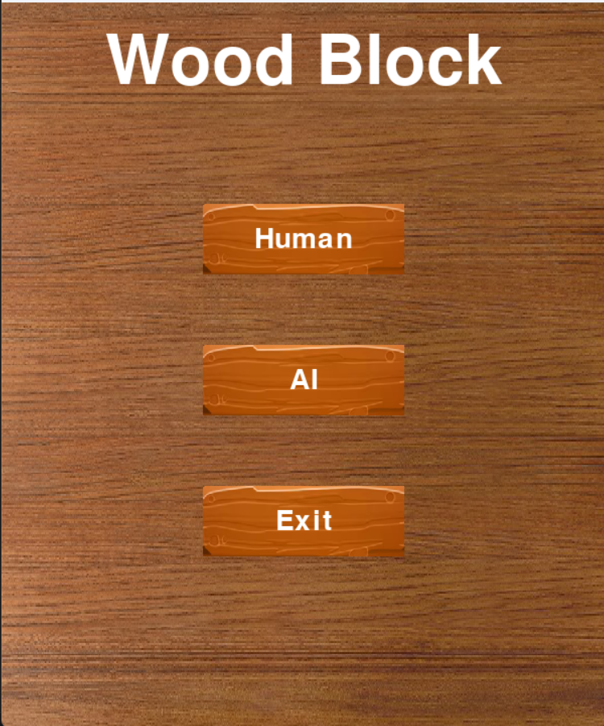
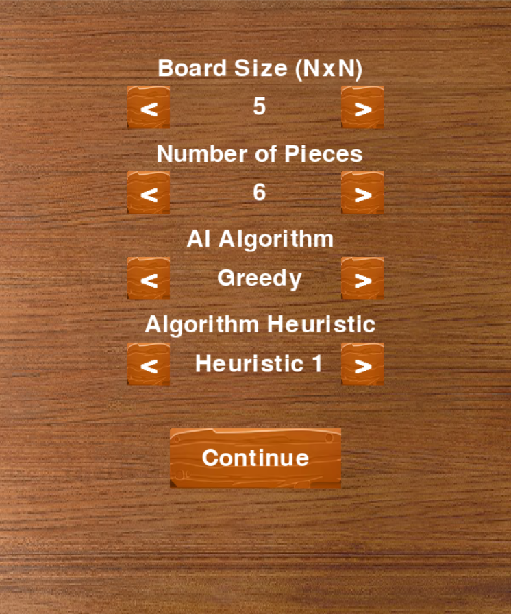
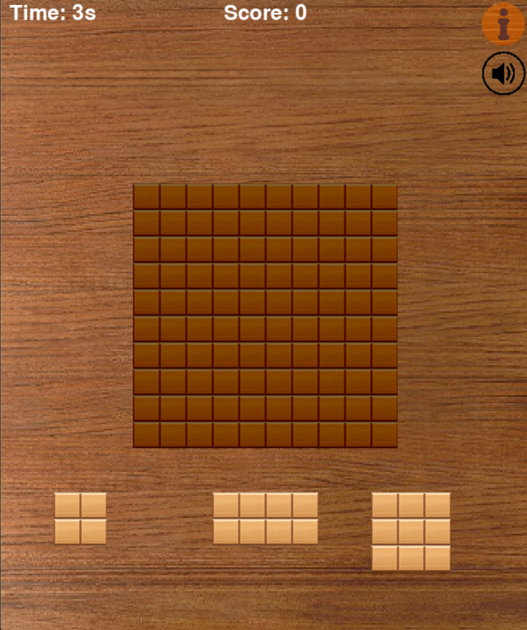
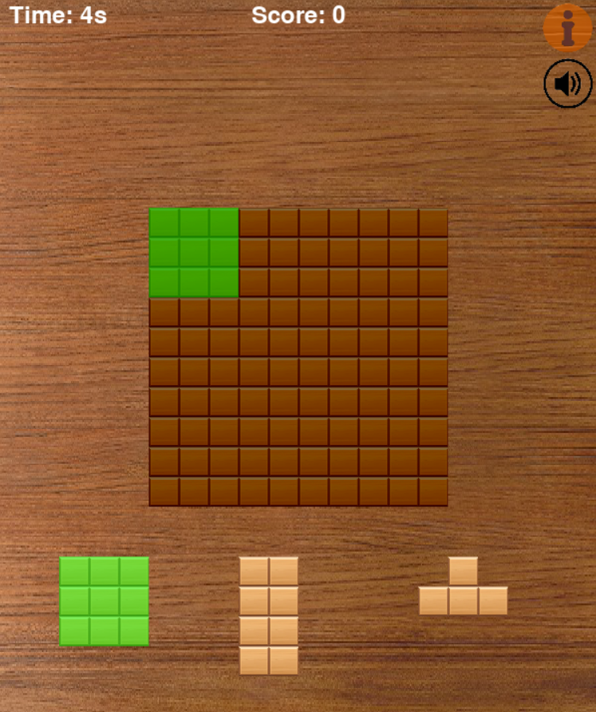
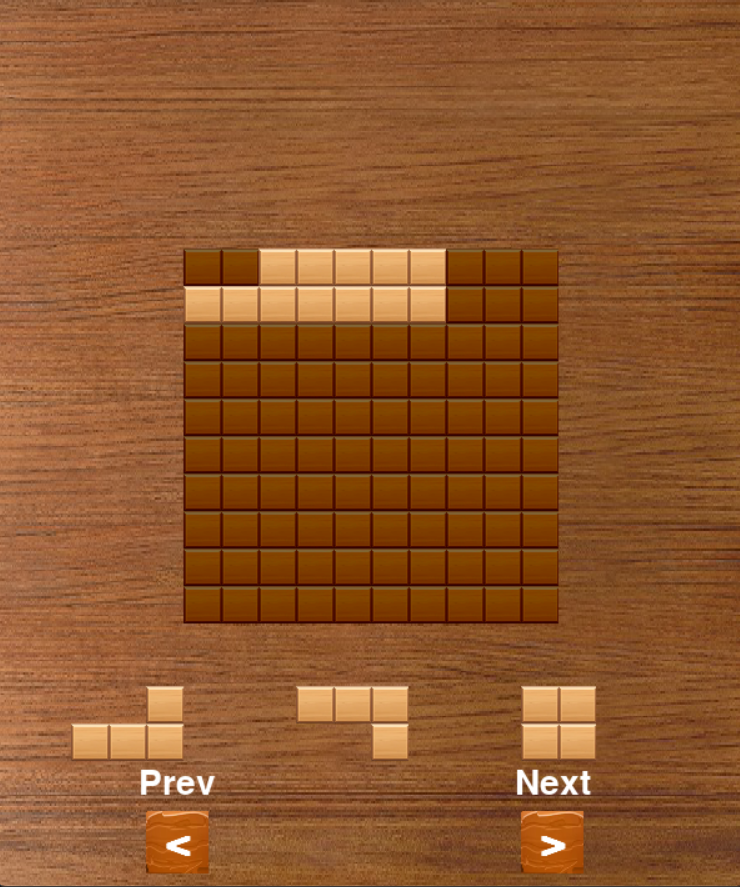
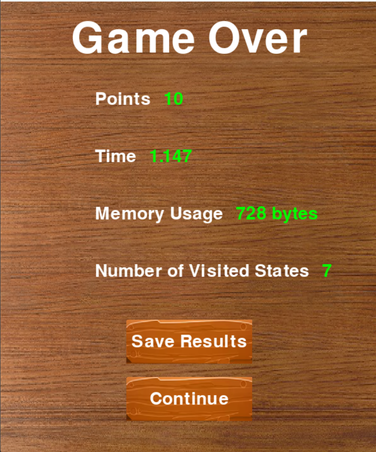
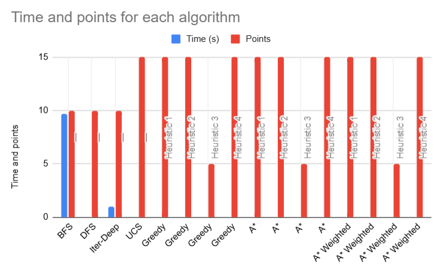
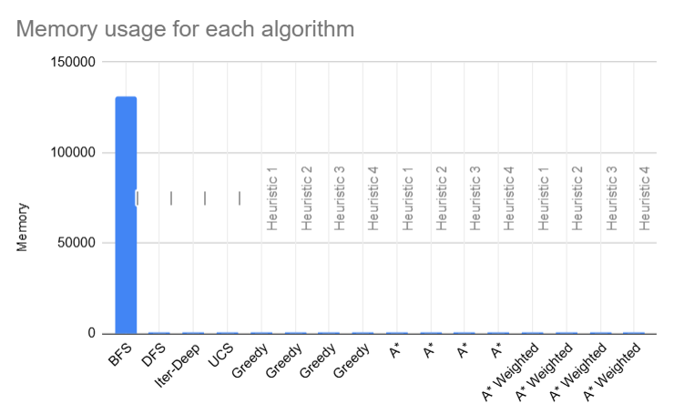
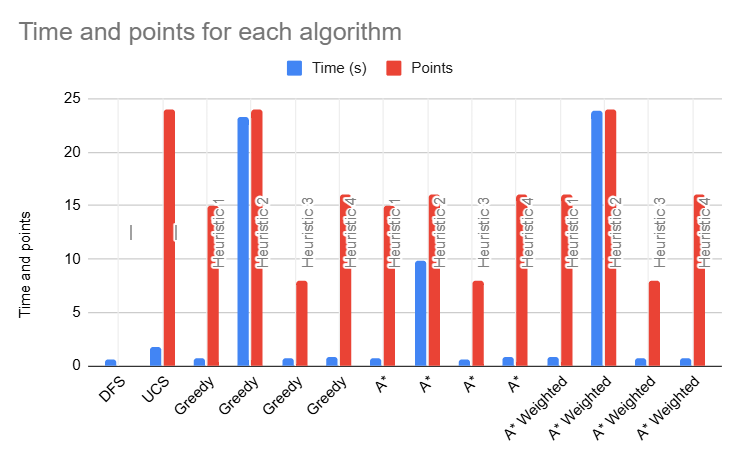
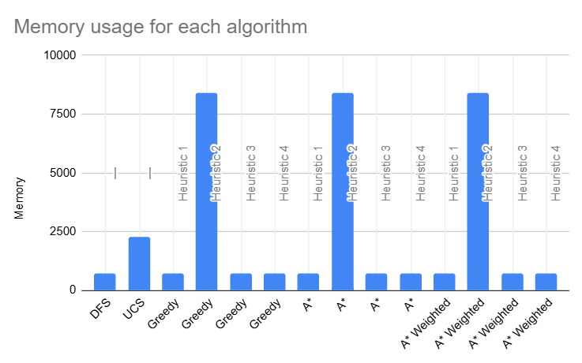

# Wood Block - IA First Project

## Game Presentation

"World Block Puzzle" is a captivating and challenging single-player game that combines elements of strategy, spatial reasoning, and pattern recognition. The objective of the game is to fit different block shapes into a given grid, filling the lines/columns of the grid without leaving any gaps.

- **Game Board:** The game board consists of a rectangular grid with varying dimensions (e.g., 5x5, 10x10).

- **Blocks:** The game includes a set of blocks of different shapes and sizes. Each block is a combination of smaller square units arranged in various patterns.

- **Objective:** The player must place all blocks on the grid in such a way that every square in a line or column are filled. The game is won when all the pieces are played.

- **Scoring:** The player's score is determined by the time taken to complete the puzzle, lines/columns filled, with n points awarded per block. Bonus points are awarded when several lines/columns are filled at the same time.

## Installation

This game was made using Python. Please make sure you have the Python installed in your machine.
To install the additional packages please use the followinf comands in your terminal:
```shell
$ pip install pygame #installs the pygame package
$ pip install numpy  #installs the numpy package
```  
After the installation of the required packages,use the following command do run the game:
```shell
$ python3 Game.py #Starts the game. The game window should appear in your screen.
```
## Implementation

- **Game Features:** The game includes menus for configuration and mode selection. There are two main modes:  Ai and Human. The AI mode consists in the AI algorithm solving the puzzle and returning the solution and set of stats (time, points, visited states, …). In the Human mode, the player can control the pieces and get hints from the AI. The game also supports reading file configurations and 

- **Data Structures:** Python Heap (Min-Heap), Python Set (Hash Table), Python Deque (Queue), Np-Arrays (Array).

- **Algorithms:** BFS, DFS, Iterative Deepening, Uniform Cost, Greedy, A*, A* weighted


## Search Problem Formulation

- **States:**
     - **Board Matrix:** B[N,M] filled with 0 or 1. 0 represents empty square and 1 represents occupied.

     - **Current Selection of pieces:** L[3], represents the pieces that can be played

     - **Queue with the next pieces:** queue Q with all the other pieces.

- **Initial State:**
    - B[N,M] = {0}, empty matrix
    - L = [P1, P2, P3], where P1,P2 and P3 are the first 3 pieces.
    - Q = {P4, P5, P6, ...}

- **Goal State:**
    - B[N,M] = _, it can have pieces
    - L = [], Q = {}, all the pieces were played

- **Operators:**
    - **Name:** Move(Piece, Position)
    - **Preconditions:** The board must have space for the piece in the position selected
    - **Effects:** Piece added to the board, removed from the current selection list and a new piece is popped from the queue and inserted into the selection list.
    - **Cost:** Moves that bring more lines/columns closer to completion have a higher cost.
    Moves that complete lines/columns have a very high cost.
    The player should choose the move with the highest cost.

- **Heuristic and evaluation functions:**
    - **Closer to complete:** Evaluates the piece/move by the improvement it gives to a line/column completion

    - **Occupied Space:**
    Evaluates the occupied space in the board after a move and removal of complete lines/columns. 
    
    - **Number of Points:**
    Evaluates the points that a move gives.
    
    - **Number of Pieces to Play:**
    Evaluates the number of pieces that the player can still play and favor states with less pieces (closer to the goal state).

## ScreenShots

**Main Menu**



**Configuration Selection**



**Game in Human Mode**



**Hint**



**Game in AI mode**



**Game Over Screen**



## Results

**Time and points - 5X5 4 Pieces**



**Memory - 5X5 4 Pieces**



**Time and points - 8X8 9 Pieces**



**Memory - 8X8 9 Pieces**




## Bibliography

- **Python docs:** https://docs.python.org/3/
- **Numpy docs:** https://numpy.org/doc/
- **PyGame docs:** https://www.pygame.org/news
- **Wood Block:** https://play.google.com/store/apps/details?id=com.block.puzzle.free.wood&hl=en
- **Wood Blocks:** https://www.crazygames.com/game/wood-blocks
- **Wood Block Journey:** https://www.crazygames.com/game/wood-block-journey
- The algorithms were based on the ones presented in the course slides


